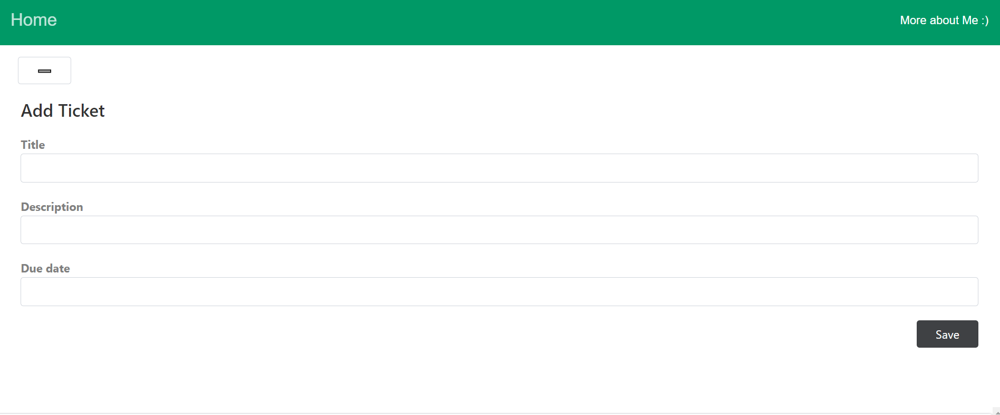

# Ticketer is a demo ticketing app


## Make it work !

* Good news! the project is dockerized so count to 3 and this section will be done
* After forking the repo, copy the `EXAMPLE.env` file to be the `.env`
* run `docker-compose up --build`
* We have 2 docker service

    i. **Ticketer** -> Backend app

    ii. **Ticketer-frontend** -> Frontend app
* You can now access the frontend app at `http://localhost:3001/users/:user_id/tickets/:ticket_id`
* When the server is up and running use `http://localhost:3000` to check that everything looks good

* running the tests using `docker-compose exec  ticketer rspec`


## Backend Routes
### Tickets
* Routes are following REST, so you can see all user tickets at `http://localhost:3000/users/:user_id/tickets`
* You can also create a new ticket at POST `http://localhost:3000/users/:user_id/tickets`

    Using the following param
    ```
    ticket: {
    title: 'First ticket',
    description: 'desc',
    due_date: '1-1-2025',
    status: 'pending',
    parent_id: "1",
    assignee_id: "1"
    }
    ```
* You can also update a ticket at PUT `http://localhost:3000/users/:user_id/tickets/:ticket_id`

    Using the following param
    ```
    ticket: {
    title: 'Updated ticket',
    description: 'desc',
    due_date: '1-1-2025',
    status: 'pending',
    parent_id: "1",
    assignee_id: "1"
    }
    ```
* You can also get a ticket at GET `http://localhost:3000/users/:user_id/tickets/:ticket_id`
* You can also delete a ticket at DELETE `http://localhost:3000/users/:user_id/tickets/:ticket_id`

### Users

* You can also create a new user at POST `http://localhost:3000/users`
* You can also update a user at PUT `http://localhost:3000/users/:user_id`
* You can also get a user at GET `http://localhost:3000/users/:user_id`
* You can also delete a user at DELETE `http://localhost:3000/users/:user_id`
## Frontend Routes

* You can see tickets list at `http://localhost:3001/users/:user_id/tickets`
* Click on the pen icon to edit the ticket or using `http://localhost:3001/users/:user_id/tickets/:ticket_id/edit` 
* Click on the New button for new ticket




## Technical Details 

1) starting the docker compose will create around 20 records of each [tickets, users] so when you test from frontend, you can easily start by user_id = 1 , ticket_id = 2) Indexes are created for each table
3) Requirements are all covered with test cases found in the spec folder

## Environment

* Ruby
* Rails
* ReactJS

## Toublehooting

* in the `APP_USER_ID` make sure you have the correct uid of your machine by using the command `id`
* Delete any cached/temp files
## TODO

* Finalize the [**API DOCUMENTATION**](http://localhost:3000/api-docs) if you are not familiar with Swagger Api Documentation (hopefully you are because this [Introductory video](https://www.youtube.com/watch?v=7MS1Z_1c5CU) is 10 mins long :) )
* Refactor the frontend code
* Add More paths for the tests cases
* Add more routes for the frontend and the rest of CRUD operations
* Add Pagination for the backend
* Combine the Virtual scroller with the API
* Add a real Loading component for the frontend
